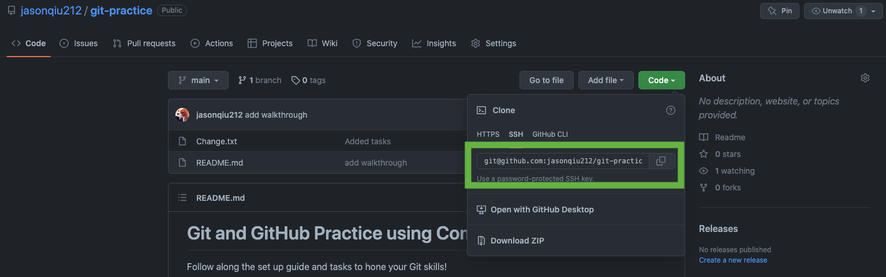
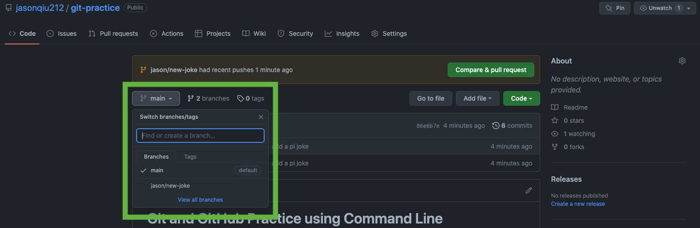

# Git and GitHub Practice using Command Line

Follow along the set up guide and tasks to hone your Git skills!

## Set up

1. Install Git on your machine. (Git should already be installed on Mac and Linux. For Windows users, check out this [guide](https://www.atlassian.com/git/tutorials/install-git#windows).)
2. Verify your Git installation: Open Terminal and type `git --version`.
3. Check if your machine has a SSH key using this [guide](https://docs.github.com/en/authentication/connecting-to-github-with-ssh/checking-for-existing-ssh-keys) and set up new SSH key if needed.
4. Add your SSH key to GitHub using this [guide](https://docs.github.com/en/authentication/connecting-to-github-with-ssh/generating-a-new-ssh-key-and-adding-it-to-the-ssh-agent).

## Tasks

Background: Congrats, you made a start up! Your product is an amazing text file that contains some humorous jokes. Follow along to expand your start up.

1. To continue working on what you have started, clone this repository onto your machine.
2. Edit `Change.txt` by adding a joke and commit it to your local repository. Eg:

```
Hello world!

Add your jokes below:
1. Why do all the numbers avoid talking to pi at a party? Cos he goes on forever!!
```

3. Push your changes to the remote repository on GitHub.

> Note: Nice! The above steps simulate coding on your own and pushing your own code onto GitHub. Since you are the only one adding features and making changes, there's not much need to branch and etc. The advantage of using Git when coding alone is that you can keep track of your past commits and push them easily to GitHub.

You now recruit a team of jokesters to expand your text file and you all agree to deploy the `main` branch in the remote repository! You wish to add another joke now.

> Be careful! To make changes, you should **not** directly commit to the `main` branch, since the changes may break your deployment.

4. To add another joke, create a new feature branch in your local repository and commit your new joke.
5. Push the new branch onto the remote repository.
6. Create a pull request to merge the your feature branch into the `main` branch.

> Note: Steps 4-6 are known as the branch workflow. This workflow is common when working in teams, since it ensures that everyone's changes are on their seperate branches and do not interfere with the `main` branch.

> Making changes through a PR allows others (usually your manager) to review your code and adds an extra layer of checks. After your manager approves the PR, your branch will be merged into the `main` branch.

Life happens and you stop coding for 100 years. The `main` branch in the remote repository has been edited many times by others.

7. Update your local repository.

> Note: Updating your local repository frequently is important when working in a team, since you want your local repo to be as updated as possible.

Congrats! Using this efficient workflow, your start up goes down as the funniest company ever!

## Walkthrough

1. To continue working on what you have started, clone this repository onto your machine.



```
# On your terminal, navigate to the directory of your choice.

git clone git@github.com:jasonqiu212/git-practice.git

# You should now see the repository in the directory.

# Navigate into the repository
cd git-practice
```

2. Edit `Change.txt` by adding a joke and commit it to your local repository.

```
# Edit the file.

git add .
git commit -m "add a pi joke"
```

3. Push your changes to the remote repository on GitHub.

```
git push

# You can now view your commit on the GitHub repository.
```

4. To add another joke, create a new feature branch in your local repository and commit your new joke.

```
# To create a new branch and navigate to the new branch.
git branch jason/new-joke
git checkout jason/new-joke

# Alternatively:
git checkout -b jason/new-joke

# Edit the file and commit the change.
git add .
git commit -m "add a new joke"

# To see the effect of branching:
git checkout main

# View the file that you edited. The changes are gone!
# That's because you made the changes in the new branch.
# The main branch is not touched.

git checkout jason/new-joke
```

5. Push the new branch onto the remote repository.

```
git push origin jason/new-joke

# origin -> The remote repository you are pushing to. Already set up when you cloned.
# jason/new-joke -> The branch you are pushing to

# You can now view your new branch on GitHub!
# Notice that the file differs when you switch branches on GitHub.
```



6. Create a pull request to merge the your feature branch into the `main` branch.


7. Update your local repository.

```
git checkout main

git pull

# By default, git pull will pull from 'origin main'
# To pull from specific branch, specify your branch
# Eg. git pull origin jason/new-joke
# Similar to git push
```
